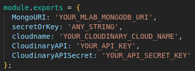

# **Synergy Back End**

## Back End for synergy, a social media app resembling twitter

## **Technologies**: Nodejs, Express, Mongoose, Cloudinary, MLAB

1. clone into directory and cd into **SocialMediaBackEnd**
2. run '**npm i**' in terminal
3. Create a **key.js** file in '**root/config**'
4. Create a MLAB account and a new database with at least one user
5. Create a free cloudinary account with folders 'home/Profile' and 'home/Post'
6. Create a **keys.js** file with the following information:
   
7. run '**npm run server**' for development mode with nodemon, or '**npm start**' for regular 'node server.js'
